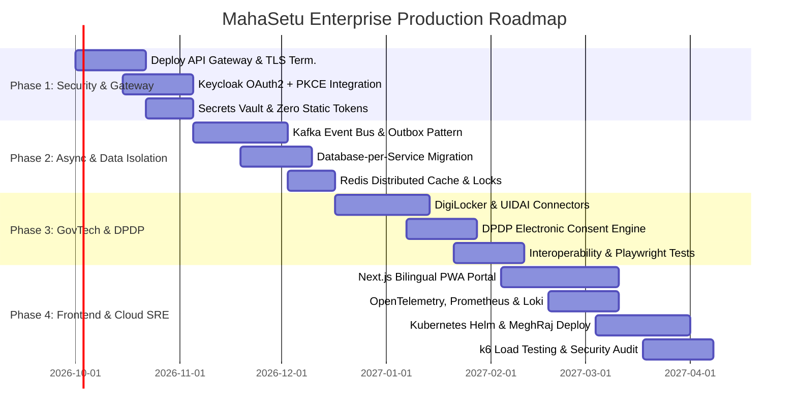

# MahaSetu Platform: Industry-Grade Production Readiness & Enterprise Engineering Roadmap
**SIH Problem Statement 26129: E-Governance Interoperability and Workflow Orchestration Platform**

---

## Executive Summary

The **MahaSetu** platform provides a well-structured foundation for addressing public service delivery challenges in Maharashtra. It demonstrates clear separation of concerns across microservices, embedded workflow orchestration via Camunda BPMN, role-based access control, and an end-to-end citizen application lifecycle.

However, transitioning from a **Hackathon Prototype / Proof of Concept (PoC)** to a **Mission-Critical Sovereign GovTech Platform** requires addressing critical architectural, security, operational, and regulatory gaps. A state-level deployment must handle:
- **Scale**: Up to 110+ million citizens across 36 districts of Maharashtra.
- **Resilience**: Fault-tolerant integration with legacy departmental systems prone to high latency and downtimes.
- **Compliance**: Adherence to the **Digital Personal Data Protection Act (DPDP) 2023**, **Guidelines for Indian Government Websites (GIGW 3.0)**, and **CERT-In cyber security mandates**.
- **Zero Downtime**: High-availability active-active multi-zone deployments with automated failover.

This document serves as the comprehensive engineering roadmap and technical blueprint to achieve enterprise production readiness.

---

## Current Architecture vs. Enterprise Target State

```
+----------------------------------------------------------------------------------------------------+
|                                    CURRENT PROTOTYPE ARCHITECTURE                                  |
+----------------------------------------------------------------------------------------------------+
| [Citizen / Officer Browser]                                                                       |
|        │ (Direct HTTP calls on ports 8081 & 8083; Mock Base64 JWTs)                                |
|        ▼                                                                                           |
| ┌──────────────────────┐   Synchronous REST    ┌───────────────────────────┐                       |
| │  application-service │ ────────────────────> │ security-workflow-service │                       |
| └──────────┬───────────┘                       └─────────────┬─────────────┘                       |
|            │                                                 │ Synchronous HTTP (Static Token)     |
|            │                                                 ▼                                     |
|            │        Shared Postgres DB               ┌───────────────────────────┐                 |
|            └───────────────────────────────────────> │ interoperability-service  │                 |
|                                                      └─────────────┬─────────────┘                 |
|                                                                    │ Mock REST / SOAP / CSV        |
|                                                                    ▼                               |
|                                                      ┌───────────────────────────┐                 |
|                                                      │     mock-systems (8091)   │                 |
|                                                      └───────────────────────────┘                 |
+----------------------------------------------------------------------------------------------------+

                                                 ▼ ▼ ▼

+----------------------------------------------------------------------------------------------------+
|                                    ENTERPRISE TARGET ARCHITECTURE                                  |
+----------------------------------------------------------------------------------------------------+
| [Citizen PWA (Next.js/TS)]               [Officer Portal (Next.js/TS)]                             |
|        │                                                │                                          |
|        └───────────────────────┬────────────────────────┘                                          |
|                                │ HTTPS (TLS 1.3 / OAuth2 Authorization Code + PKCE)                |
|                                ▼                                                                   |
|                   ┌──────────────────────────┐                                                     |
|                   │    Cloudflare WAF / CDN  │                                                     |
|                   └────────────┬─────────────┘                                                     |
|                                │                                                                   |
|                                ▼                                                                   |
|                   ┌──────────────────────────┐      OIDC Token Validation                          |
|                   │    API Gateway (Envoy)   │ ◄─────────────────────────────┐                     |
|                   │ (Rate Limit, Auth, CORS) │                               │                     |
|                   └────────────┬─────────────┘                               ▼                     |
|                                │                                 ┌───────────────────────┐         |
|         ┌──────────────────────┼──────────────────────┐          │  Keycloak Cluster HA  │         |
|         │ mTLS                 │ mTLS                 │ mTLS     └───────────────────────┘         |
|         ▼                      ▼                      ▼                                            |
| ┌────────────────┐   ┌────────────────────┐   ┌───────────────────────┐                            |
| │  Application   │   │ Security Workflow  │   │   Interoperability    │                            |
| │    Service     │   │   Engine (Camunda) │   │     Service Mesh      │                            |
| └───────┬────────┘   └─────────┬──────────┘   └───────────┬───────────┘                            |
|         │                      │                          │                                        |
|         └───────────┬──────────┴──────────────────────────┘                                        |
|                     │ Event Stream (Kafka Cluster + Transactional Outbox)                          |
|                     ▼                                                                              |
|      ┌──────────────────────────────┐                                                              |
|      │   Apache Kafka Event Bus     │ ◄─── Dead Letter Queues (DLQ)                                |
|      │ (Events: AppSubmitted, etc.) │                                                              |
|      └──────────────┬───────────────┘                                                              |
|                     │                                                                              |
|         ┌───────────┴───────────┬───────────────────────────┐                                      |
|         ▼                       ▼                           ▼                                      |
| ┌──────────────┐      ┌──────────────────┐        ┌───────────────────┐                            |
| │ App Database │      │ Workflow DB      │        │ Audit WORM Store  │                            |
| │ (PostgreSQL) │      │ (PostgreSQL HA)  │        │ (Hash-Chained/S3) │                            |
| └──────────────┘      └──────────────────┘        └───────────────────┘                            |
|                                                             ▲                                      |
|                                                             │ Real Department APIs                 |
|                                                             ▼                                      |
|                               ┌────────────────────────────────────────────────────────┐           |
|                               │ MahaDBT | DigiLocker | UIDAI AUA | Aaple Sarkar | PFMS │           |
|                               └────────────────────────────────────────────────────────┘           |
+----------------------------------------------------------------------------------------------------+
```

---

## 1. Architecture & Distributed Systems

### 1.1 Unified API Gateway Layer
* **Problem**: The web clients directly query internal service ports (`:8081`, `:8083`), exposing microservice topology and creating cross-origin concerns.
* **Target Solution**:
  - Deploy **Spring Cloud Gateway** or an **Envoy / Kong API Gateway** as the single public entry point (`https://mahasetu.maharashtra.gov.in/api/...`).
  - **Responsibilities**:
    - Centralized TLS 1.3 termination and cipher hardening.
    - Path-based routing (`/api/v1/applications/**` -> Application Service; `/api/v1/workflows/**` -> Security Workflow Service).
    - IP and Token-based Rate Limiting (Redis Token Bucket algorithm) to prevent brute-force attacks and service degradation.
    - Standardized request tracing: Generate or propagate `X-Request-ID` and W3C `traceparent` headers.
    - Global CORS policy restricted to approved government domains.

### 1.2 Event-Driven Architecture (Kafka & Outbox Pattern)
* **Problem**: Microservices communicate synchronously over HTTP. A delay or failure in `security-workflow-service` directly blocks or fails application submission in `application-service`.
* **Target Solution**:
  - Deploy a multi-broker **Apache Kafka** cluster (or managed AWS MSK / Redpanda).
  - Adopt the **Transactional Outbox Pattern**:
    - `application-service` writes the application entity and an `outbox_event` record in a single local database transaction.
    - A Change Data Capture (CDC) worker (Debezium) or Spring Scheduled Worker publishes events to Kafka (`application.lifecycle.events`).
  - **Topics & Partitioning**:
    - `mahasetu.application.submitted` (Partitioned by `citizenId` to guarantee ordered processing).
    - `mahasetu.workflow.state-changed`
    - `mahasetu.interop.verification-requested`
    - `mahasetu.audit.events`
  - Implement **Dead Letter Queues (DLQ)** with automatic retry policies (exponential backoff with jitter) and an administrative manual replay dashboard.

### 1.3 Database-per-Service & Schema Isolation
* **Problem**: All services currently point to the same database (`mahasetu`) and share entity tables (`consents`, `audit_logs`).
* **Target Solution**:
  - Split into autonomous databases:
    - `mahasetu_application`: Manages `citizens`, `departments`, `services`, `applications`.
    - `mahasetu_workflow`: Dedicated to Camunda BPMN engine tables (`ACT_*`) and task reviews.
    - `mahasetu_consent`: Dedicated consent artifact repository.
    - `mahasetu_audit`: Append-only compliance log.
  - Enforce independent schema migrations via **Flyway** within each service repository.
  - Separate connection pools (HikariCP) sized according to workload profiles.

### 1.4 Distributed Caching & Locking
* **Problem**: `interoperability-service` uses an in-memory Caffeine cache that does not share state across container replicas.
* **Target Solution**:
  - Deploy a **Redis Cluster (Redis 7.x)** with Sentinel or Master-Replica replication.
  - **Use Cases**:
    - Distributed caching of normalized master data (e.g., service catalog, department metadata).
    - Distributed locking via **Redisson** to prevent race conditions during concurrent officer review task claims.
    - Token revocation list (denylist) for immediate session invalidation.

---

## 2. Security, Compliance & Identity (GovTech Standards)

### 2.1 Keycloak Enterprise Identity & Access Management (IAM)
* **Problem**: Frontend currently generates demo tokens (`buildDemoToken`) using base64 encoding; `interoperability-service` checks a static pre-shared token.
* **Target Solution**:
  - **Citizen Flow**: Keycloak OAuth2.0 / OpenID Connect **Authorization Code Flow with PKCE** (Proof Key for Code Exchange).
  - **Officer / Admin Flow**: Keycloak integrated with State LDAP / Active Directory and multi-factor authentication (MFA via OTP / TOTP).
  - **Service-to-Service Flow**: Keycloak **Client Credentials Grant** with short-lived access tokens (5–15 minutes) and automated rotation.
  - **Token Storage**: Implement a **Backend-for-Frontend (BFF)** pattern where tokens are stored in encrypted `HttpOnly`, `SameSite=Strict`, `Secure` cookies, eliminating XSS token exposure.
  - Eliminate all static tokens in `interoperability-service`, configuring it as a standard Spring Security OAuth2 Resource Server.

### 2.2 Digital Personal Data Protection (DPDP) Act 2023 Compliance
* **Problem**: Plain text consent strings and lack of formal citizen data subject rights mechanisms.
* **Target Solution**:
  - **Electronic Consent Artifact**: Implement the **DEPA 2.0 / MeitY Consent Architecture**:
    - Granular, time-bound consent artifacts containing purpose codes, data scopes, validity timestamps, and cryptographic signatures (JWS).
  - **Citizen Rights Portal**:
    - **Right to Access**: Citizen can view all data retrieved from external departments.
    - **Right to Correction**: Ability to challenge and update outdated department records.
    - **Right to Erasure / Revocation**: One-click revocation of consent triggering automated cascading data purging across staging tables.
  - **Data Minimization**: Enforce strict data filtering—only store the exact attributes needed for scheme eligibility calculation; discard all intermediate payload dumps.

### 2.3 PII Protection & Data Encryption
* **Problem**: Plaintext storage of `mobile`, `email`, and citizen identifiers in PostgreSQL.
* **Target Solution**:
  - **Aadhaar Protection**: Never store raw 12-digit Aadhaar numbers. Use UIDAI-compliant **Aadhaar Vault** architecture storing only tokenized Reference Keys. Mask all citizen display IDs (e.g., `XXXX-XXXX-1234`).
  - **Column-Level Encryption (CLE)**: Encrypt sensitive fields (phone, email, bank details, disability status) at rest using AES-256-GCM via `pgcrypto` or JPA Attribute Converters.
  - **KMS / Vault Integration**: Integrate **HashiCorp Vault** or AWS KMS for encryption key lifecycle management and automatic key rotation.

### 2.4 Tamper-Proof Audit Logging & CERT-In Compliance
* **Problem**: Current audit logs are basic database records subject to accidental modification or deletion.
* **Target Solution**:
  - Mandatory compliance with CERT-In directives requiring **180-day audit log retention**.
  - Structured, immutable audit trail: Each log entry includes `timestamp_utc`, `actor_id`, `actor_ip`, `geo_location`, `action`, `resource_type`, `resource_id`, `purpose`, and `previous_record_hash`.
  - Cryptographic hash chaining (each log entry hashes the previous entry's checksum) to make log tampering mathematically detectable.
  - Asynchronous streaming of audit events to **WORM (Write Once, Read Many) Cloud Storage** (e.g., AWS S3 with Object Lock in Compliance Mode).

---

## 3. Real-World Interoperability & Integration Engine

### 3.1 Production Government Connectors
* **Problem**: Mock systems currently simulate hardcoded responses.
* **Target Solution**:
  Replace mock services with resilient, production-ready connectors:
  1. **DigiLocker Gateway**:
     - OAuth2-based citizen consent flow.
     - Direct extraction of digital caste certificates, income certificates, marksheets, and driving licenses with XML-DSig signature verification.
  2. **UIDAI AUA/KUA Gateway**:
     - Integration with Authorized User Agency (AUA) HSMs for Aadhaar OTP-based demographic verification.
  3. **MahaDBT & Aaple Sarkar Bridge**:
     - Bidirectional status synchronization with Maharashtra's unified welfare portal.
  4. **PFMS & NPCI (National Payments Corporation of India)**:
     - Direct Benefit Transfer (DBT) beneficiary validation via Aadhaar Payment Bridge System (APBS).

### 3.2 Connector Resilience, Throttling & Bulkheading
* **Problem**: State department legacy servers can easily be overwhelmed by high-volume spikes.
* **Target Solution**:
  - **Client-Side Throttling**: Configure Resilience4j RateLimiters tailored to each external department's known capacity (e.g., max 20 req/sec for Education CSV server, max 50 req/sec for Employment REST API).
  - **Circuit Breakers & Fallbacks**: Automatically trip open when error rates exceed 40%, returning graceful degraded responses or scheduling background re-checks.
  - **Bulkhead Pattern**: Isolate thread pools per connector so that a degraded Health SOAP service does not exhaust threads needed for Employment verification.
  - **Asynchronous SFTP Ingestion Engine**: Scheduled batch processing using Apache Camel or Spring Batch with PGP signature validation, SHA-256 checksum verification, and anti-virus scanning.

---

## 4. Modern Citizen & Officer Web Experience

### 4.1 Frontend Architecture Migration (Next.js / TypeScript)
* **Problem**: The current frontend is a vanilla HTML/CSS/JS application lacking modularity, state management, and type safety.
* **Target Solution**:
  - Rebuild the portal using **Next.js (App Router) + TypeScript**.
  - State management and API synchronization using **TanStack Query (React Query)** with automatic retry and optimistic updates.
  - UI Component Library: **Shadcn/UI** with **Tailwind CSS**, providing responsive, enterprise-grade components.
  - Server-Side Rendering (SSR) for initial loads and static content; Client Components for interactive forms.

### 4.2 Accessibility & Bilingual Inclusion (GIGW 3.0 & WCAG 2.1 AA)
* **Problem**: English-only interface, lacking accessibility controls.
* **Target Solution**:
  - **Bilingual by Design**: Full internationalization (`next-intl`) supporting **Marathi (`mr-IN`)** as the primary language alongside English.
  - **GIGW 3.0 Compliance**:
    - High contrast toggle (Dark/Light/High Contrast Yellow-on-Black).
    - Dynamic text resizing controls without breaking layout (`A-`, `A`, `A+`).
    - Complete screen reader compatibility (`aria-*` labels, proper landmark tags, skip-to-content links).
    - 100% keyboard navigability with visible focus indicators.
  - **Progressive Web App (PWA)**: Service Worker caching for offline form drafts and slow rural 2G/3G connectivity.

### 4.3 Secure Document Upload Pipeline
* **Problem**: No mechanism for citizens to attach supporting proofs or documents.
* **Target Solution**:
  - Direct-to-Storage Uploads via **Pre-Signed URLs** (MinIO / S3). Files never pass through microservice memory.
  - Automated file pipeline:
    1. Validation: Allowed file types (`PDF`, `JPEG`, `PNG`), max size (5 MB).
    2. Malware Scanning: Real-time scan via containerized **ClamAV**.
    3. Optical Character Recognition (OCR) / QR verification: Automated pre-fill verification of document numbers.

---

## 5. Observability, SRE & Operations

### 5.1 End-to-End Distributed Tracing
* **Target Solution**:
  - Instrument all Spring Boot services with the **OpenTelemetry (OTel) Java Agent**.
  - Propagate W3C `traceparent` headers across Gateway -> Application Service -> Kafka -> Camunda BPMN -> Interoperability Service.
  - Export traces to **Grafana Tempo** or **Jaeger** to visualize bottlenecks and cross-service latencies.

### 5.2 Centralized Logging & Metrics Dashboard
* **Target Solution**:
  - **Logging**: Output structured JSON logs using Logback with ECS (Elastic Common Schema) or OpenTelemetry format, ingested by **Grafana Loki** or **ELK Stack**.
  - **Metrics**: Standardize Micrometer metrics exported to **Prometheus**.
  - **Grafana Enterprise Dashboards**:
    - **Executive Business Dashboard**: Applications submitted, approved, rejected, average turnaround time (TAT) per department.
    - **SRE Service Health Dashboard**: P50, P95, P99 request latencies, HTTP 5xx error rates, JVM GC pauses, DB connection pool utilization.
    - **Workflow Operations Dashboard**: Camunda active process instances, stuck incidents, officer task queue backlog.

### 5.3 Automated Incident Management & Alerts
* **Target Solution**:
  - Alertmanager routing to PagerDuty, Slack, and SMS for critical incidents:
    - Elevated API 5xx rate (> 2% over 5 minutes).
    - External department integration failure rate (> 50%).
    - Kafka consumer group lag growing continuously.
    - Camunda unhandled BPMN incident threshold reached.

---

## 6. Quality Engineering & Testing Strategy

### 6.1 Test Coverage Remediation
* **Problem**: `interoperability-service`, `mock-systems`, and the frontend currently have **0 automated tests**.
* **Target Solution**:
  - **Interoperability Service**:
    - Comprehensive unit tests for `HealthTransformer`, `EmploymentTransformer`, `EducationTransformer`.
    - Integration tests with **WireMock** simulating network drops, malformed XML SOAP responses, corrupted CSVs, and HTTP 504 timeouts.
  - **End-to-End (E2E) Browser Testing**:
    - Implement **Playwright** test suite testing full user workflows:
      * Citizen logs in -> selects scheme -> grants consent -> submits application.
      * Officer claims task -> verifies data -> approves application.
      * Citizen views approved status and downloads digitally signed certificate.
  - **Load & Stress Testing**:
    - Conduct **k6** or **Gatling** load tests simulating peak state deadlines (target: 25,000 requests/sec with P95 latency < 500ms).

### 6.2 Automated CI/CD Pipeline
* **Target Solution**:
  - Deploy **GitHub Actions** or **GitLab CI** pipelines:
    - **Linting & Formatting**: Checkstyle, Spotless, ESLint, Prettier.
    - **Static Analysis (SAST)**: SonarQube quality gate enforcing > 85% code coverage and 0 security vulnerabilities.
    - **Security Scanning**: Trivy (container vulnerabilities), Snyk / OWASP Dependency-Check (CVEs).
    - **Automated Artifact Publishing**: Signed container images pushed to Harbor or AWS ECR with Cosign.

---

## 7. Cloud-Native Deployment & Infrastructure as Code (IaC)

### 7.1 Kubernetes (K8s) Architecture
* **Target Solution**:
  - Transition from Docker Compose to **Kubernetes manifests / Helm Charts** deployable on **MeghRaj (Government of India GI Cloud)**, NIC Cloud, or AWS EKS.
  - **High Availability Topology**:
    - Multi-AZ deployment (minimum 3 availability zones).
    - Horizontal Pod Autoscaler (HPA) scaling pods based on CPU, Memory, and Kafka lag.
    - Pod Disruption Budgets (PDB) and Anti-Affinity rules ensuring pods are distributed across physical nodes.
    - Network Policies enforcing zero-trust container isolation.

### 7.2 GitOps with ArgoCD
* **Target Solution**:
  - Infrastructure defined as code via **Terraform / OpenTofu**.
  - Continuous Delivery managed via **ArgoCD** following GitOps best practices.
  - Blue-Green or Canary rollout strategies to eliminate citizen downtime during state platform upgrades.

---

## 8. Phased Implementation Roadmap



### Phase Breakdown

| Phase | Focus Area | Key Deliverables | Duration |
| :--- | :--- | :--- | :--- |
| **Phase 1** | **Security & Ingress Foundation** | API Gateway deployment, Keycloak Authorization Code + PKCE, HashiCorp Vault secrets integration, removal of all mock tokens. | Weeks 1 – 4 |
| **Phase 2** | **Asynchronous Decoupling & Data Isolation** | Kafka cluster setup, Transactional Outbox Pattern, Database-per-service separation, Redis distributed caching. | Weeks 5 – 8 |
| **Phase 3** | **Real GovTech Integration & DPDP Compliance** | DigiLocker and UIDAI AUA connectors, DEPA-compliant digital consent manager, PII column encryption, Playwright E2E testing. | Weeks 9 – 13 |
| **Phase 4** | **Production Frontend, SRE & Cloud Scaling** | Next.js bilingual PWA (Marathi & English), OpenTelemetry distributed tracing, Kubernetes Helm charts, MeghRaj deployment, CERT-In audit. | Weeks 14 – 18 |

---

## 9. Non-Functional Requirements (NFR) Acceptance Matrix

| Parameter | Current Prototype | Enterprise Production Target |
| :--- | :--- | :--- |
| **System Availability (SLA)** | Single instance (~95%) | **99.95%** (Multi-AZ Active-Active) |
| **Concurrent Users** | ~50 concurrent | **50,000+ concurrent** |
| **P95 Latency (API)** | Variable (500ms - 3s) | **< 300ms** for citizen read/write endpoints |
| **Data Protection** | Plaintext database fields | **AES-256-GCM Column Encryption + Aadhaar Vault** |
| **Regulatory Compliance** | None | **DPDP Act 2023, GIGW 3.0, CERT-In, ISO 27001** |
| **Disaster Recovery (RTO / RPO)** | Manual (~hours) | **RTO < 30 mins, RPO < 5 mins** |
| **Languages Supported** | English only | **Marathi (`mr-IN`) & English** |
| **Test Coverage** | ~50% (0% on interop/front) | **> 85% Code Coverage + Automated E2E** |
